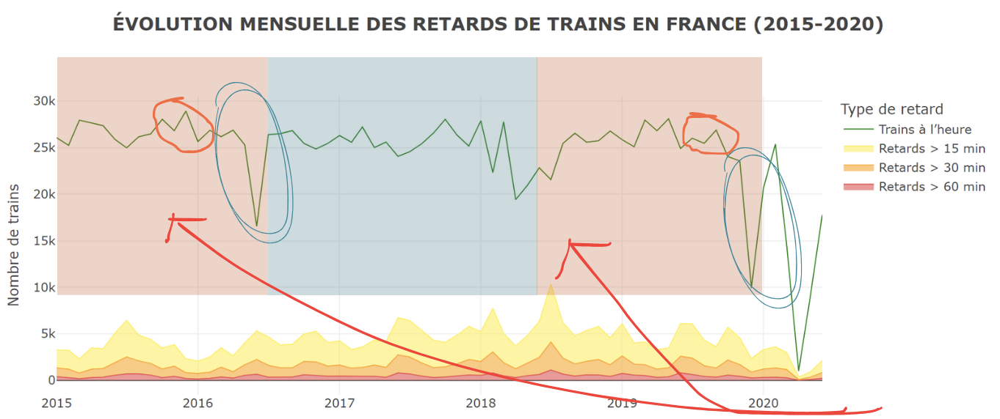
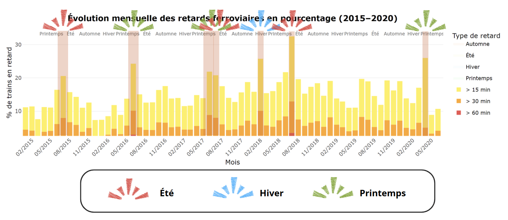

```{r setup-css, echo=FALSE, results='asis'}
cat("
<style>
.leaflet-control.legend.custom-legend .legend-labels {
  margin-left: 30px !important;
}
</style>
")
```

# Introduction 

<div class="card border-primary mb-3"style="font-size: 1.3rem;">
  <div class="card-header">Introduction</div>
  <div class="card-body">

Nous sommes un groupe de **4 étudiants** de l'**Université de Technologie de Troyes** et, dans le cadre de notre formation, nous réalisons un projet pour l'enseignement **"IF36 – Visualisation de données"**.  
Notre objectif est d'**analyser un jeu de données** de notre choix de manière approfondie.

Nous avons choisi de travailler sur un **jeu de données ouvert** provenant de plusieurs sources françaises, notamment **SNCF** et **Île-de-France Mobilités**.  
Ce jeu de données offre une **vue détaillée** du réseau de transport ferroviaire en France, incluant :

- la **ponctualité** des **TGV**,
- les **validations de titres de transport**,
- la **géolocalisation des arrêts**.

Ce dataset nous permet de **mieux comprendre** les dynamiques du réseau ferré français, aussi bien en termes de **régularité** que de **fréquentation**.  


  </div>
</div>
# Contexte d'étude

<p align="justify">

## Nettoyage du dataset

**Avant de pouvoir effectuer nos analyses et visualisations**, nous avons dû procéder à un **important travail de nettoyage des données**, comprenant :

- **Renommage des colonnes** pour une meilleure lisibilité,
- **Traitement des valeurs manquantes**,
- **Détection et correction des valeurs aberrantes**,
- **Uniformisation des types de données**.

Nous avons également **supprimé les données concernant les gares étrangères**, afin de concentrer notre étude uniquement sur le **territoire français**.

</p>


<div class="card border-primary mb-3"style="font-size: 1.3rem;">
  <div class="card-header">Etapes</div>
  <div class="card-body">
**1. Importation du fichier CSV**
<p align="justify"> 
Nous avons tout d'abord importé notre jeu de données à l'aide des librairies <b>dplyr</b> et <b>readr</b>. 
</p>
```{r, echo=FALSE, warning=FALSE, message=FALSE, fig.width=6, fig.height=4}
library(dplyr)
library(readr)

# Chargement du fichier Train_dataset.csv
data_trains <- read_csv("data/Train_dataset.csv")
```

**2. Suppression de colonnes inutiles**

<p align="justify"> 
Certaines colonnes, contenant uniquement des commentaires textuels ("Comment (optional) delays at departure" et "Comment (optional) delays on arrival"), sont supprimées car elles ne sont pas pertinentes pour notre analyse. 
</p>
```{r, echo=FALSE, warning=FALSE, message=FALSE, fig.width=6, fig.height=4}

# Suppression des colonnes de commentaires
data_trains <- data_trains %>%
  select(-`Comment (optional) delays at departure`, -`Comment (optional) delays on arrival`)
```

**3. Nettoyage des noms de colonnes**
<p align="justify"> 
Pour faciliter l'utilisation du dataset, nous avons standardisé les noms de colonnes : 
<ul> <li>Suppression des parenthèses et de leur contenu</li> <li>Remplacement des espaces par des underscores <b>_</b></li> <li>Suppression des underscores inutiles en fin de nom</li> </ul> 
</p>
```{r, echo=FALSE, warning=FALSE, message=FALSE, fig.width=6, fig.height=4}
# Nettoyage des noms de colonnes
names(data_trains) <- gsub("\\s*\\([^)]*\\)", "", names(data_trains)) # #Retirer les parenthèses
names(data_trains) <- gsub(" ", "_", names(data_trains))              # #Remplacer les espaces par des underscores
names(data_trains) <- gsub("_$", "", names(data_trains))              # #Supprimer un underscore final inutile
```

**4. Suppression des gares étrangères**
<p align="justify"> 
Notre analyse portant exclusivement sur la France métropolitaine, nous avons filtré les données pour supprimer les trajets passant par certaines gares étrangères (Suisse, Allemagne, Italie, Espagne). 
</p>
```{r, echo=FALSE, warning=FALSE, message=FALSE, fig.width=6, fig.height=4}

# Liste des gares étrangères à exclure
gares_etranger <- c("LAUSANNE", "ZURICH", "STUTTGART", "ITALIE", "GENEVE", "MADRID", "FRANCFORT","BARCELONA")

# Filtrage des trajets
data_trains <- data_trains %>%
  filter(!(Departure_station %in% gares_etranger | Arrival_station %in% gares_etranger))
```

**5. Analyse des données manquantes**
<p align="justify"> 
Enfin, nous avons calculé le nombre de lignes contenant au moins une valeur manquante (<b>NA</b>) pour évaluer la qualité globale du dataset : 
</p>
```{r, echo=FALSE, warning=FALSE, message=FALSE, fig.width=6, fig.height=4}
# Nombre de lignes avec au moins une valeur manquante
nombre_NA <- sum(rowSums(is.na(data_trains)) > 0)
nombre_NA

# Extraction des lignes contenant des valeurs manquantes
data_NA <- data_trains[apply(data_trains, 1, function(x) any(is.na(x))), ]
```


</div>
</div>

## Les données du dataset

<div class="card border-primary mb-3"style="font-size: 1.3rem;">
  <div class="card-header">Données</div>
  <div class="card-body">
**Ce dataset est composé de 7 fichiers issus de différentes sources publiques françaises.**
<p align="justify"> 
1. Regularities_by_liaisons_Trains_France.csv <BR>
➤ Données sur la ponctualité des trains par liaison (retards, annulations, régularité, etc.)
</p>

<p align="justify"> 
2. Travel_titles_validations_in_Paris_and_suburbs.csv <BR>
➤ Nombre quotidien de validations de titres de transport (navigo, ticket) en Île-de-France 
</p>

<p align="justify"> 
3. Shapefile des arrêts de transport (Station_shapefiles.*) <BR>
Ensemble de 5 fichiers SIG permettant de visualiser les stations géolocalisées sur une carte : <BR>

Station_shapefiles.shp : géométrie des arrêts <BR>
Station_shapefiles.dbf : attributs (noms, codes, types) <BR>
Station_shapefiles.shx, .prj, .cpg : métadonnées, projection, encodage <BR>
</p> 

</div>
</div>

## Les limites anticipées


<div class="card border-primary mb-3"style="font-size: 1.3rem;">
  <div class="card-header">Limites Anticipées</div>
  <div class="card-body">

<p align="justify"> 
1. Limitation géographique : Paris et sa proche banlieue <BR>
2. Faire attention au détail des métadonnées, notamment pour les causes d'incident <BR>
3. Validations sur une periodicité plus courte que le premier dataset, uniquement 2019 <BR>
4. Faire attention à l'agrégat qui pourrait masquer des variations intra-quotidiennes <BR>
5. Mise en relation des deux csv : à priori, pas d'attribut commun <BR>
6. Colonne de commentaires : informations utiles mais difficilement analysable et trop souvent nulles (77%) <BR>
7. Colonne de nombre de validations : imprécision lorsque la valeur est en dessous de 5 (la valeur de la ligne est "less than 5", ce qui complique une conversion de la colonne en entier) <BR>
</p>

</div>
</div>

# Exploration

<p align="justify">
Dans un premier temps, nous souhaitons obtenir une <b>vision globale des données</b>, afin d’identifier par exemple :
<ul>
  <li>les <b>gares les plus importantes</b>, qui concentrent la majorité du trafic,</li>
  <li>ou encore celles affichant les <b>retards moyens les plus élevés</b>.</li>
</ul>

Pour cela, nous allons produire quelques <b>visualisations simples</b> permettant de <b>nous familiariser avec le jeu de données</b>.  
Voici les trois visualisations explorées :
<ul>
  <li>une <b>visualisation de la répartition des temps de trajets</b> sur une année précise (une extension dynamique par année sera proposée dans le dashboard),</li>
  <li>une <b>visualisation des gares avec les temps moyens de trajet les plus élevés</b>, toujours sur une année spécifique,</li>
  <li>une <b>visualisation de la fréquentation des gares</b>, pour identifier celles qui participent le plus au <b>trafic ferroviaire</b>.</li>
</ul>
</p>


## Durée moyenne des trajets en France

<div class="card text-white bg-secondary mb-3" style="border-radius: 12px; max-width: fit-content; margin: auto;">
  <div class="card-body bg-white" style="padding: 1rem; border-bottom-left-radius: 12px; border-bottom-right-radius: 12px;">
    
```{r echo = FALSE, warning=FALSE, message=FALSE, fig.width=6, fig.height=4}
library(ggplot2)

# Filtrer l'année 2019
data_2019 <- data_trains %>%
  filter(Year == 2019)

# Histogramme
ggplot(data_2019, aes(x = Average_travel_time)) +
  geom_histogram(binwidth = 15, fill = "cornflowerblue", color = "white", boundary = 0) +
  geom_hline(yintercept = 0, color = "black") + 
  geom_vline(xintercept = 0, color = "black") +
  labs(title = "Durée moyenne des trajets en 2019",
       x = "Durée moyenne (heures)",
       y = "Nombre de trajets") +
   scale_x_continuous(
    breaks = seq(0, 450, by = 60),  
    labels = function(x) x/60        
  ) +
  coord_cartesian(xlim = c(0, 450)) +
  theme_minimal()

```
</div>
</div>
<p align="justify">
<div class="card text-white bg-primary mb-3">
  <div class="card-header">Interprétation</div>
  <div class="card-body">
Ce graphique permet d’obtenir une <b>vision de la répartition des durées de trajets</b> notamment que :
<ul>
  <li><b>La majorité des trajets durent moins de 4 heures</b>, ce qui montre une forte concentration autour des moyennes courtes.</li>
  <li>Les <b>trajets de plus de 5h30 sont très rares</b> 
  <li>Le <b>pic de fréquence</b> est situé autour de <b>2 heures</b> : c’est la durée de trajet la plus courante dans le réseau analysé.</li>
</ul>
</div>
</div>

</p>


## Temps de trajet moyen par gares

<div class="card text-white bg-secondary mb-3" style="border-radius: 12px; margin: auto;">
  <div class="card-body bg-white" style="padding: 1rem; border-bottom-left-radius: 12px; border-bottom-right-radius: 12px; overflow: visible">
```{r echo = FALSE, warning=FALSE, message=FALSE, fig.width=8, fig.height=4}

library(dplyr)
library(ggplot2)

# 1. Filtrer uniquement l'année 2019
data_2019 <- data_trains %>%
  filter(Year == 2019)

# 2. Calculer la durée moyenne des trajets en heures par gare
top_gares_2019 <- data_2019 %>%
  group_by(Departure_station) %>%
  summarise(mean_travel_time_min = mean(Average_travel_time, na.rm = TRUE)) %>%
  mutate(mean_travel_time_hr = mean_travel_time_min / 60) %>%
  arrange(desc(mean_travel_time_hr)) %>%
  slice(1:20)


ggplot(top_gares_2019, aes(x = reorder(Departure_station, mean_travel_time_hr), y = mean_travel_time_hr, fill = mean_travel_time_hr)) +
  geom_col() +
  geom_text(aes( y = mean_travel_time_hr - 0.1,label = round(mean_travel_time_hr, 1)),   # Ajout des étiquettes arrondies à 1 décimale
            size = 3.5,                                 # Taille du texte
            color = "white",                            # Couleur du texte (blanc pour contraste)
            fontface = "bold",                          # Gras pour plus de visibilité
            hjust = 1,                                  # Positionner l'étiquette à la fin de la barre
            vjust = 0.4) +  # Centrer verticalement l'étiquette
  scale_fill_gradient(
    low = "lightblue",  # Couleur pour les petits temps
    high = "navy"       # Couleur pour les grands temps
  ) +
  coord_flip() +
  labs(
    title = "Gares avec les temps de trajet moyens les plus longs (2019)",
    x = "Gare de départ",
    y = "Durée moyenne du trajet (heures)"
  ) +
  theme_minimal() +
  theme(
    axis.title.x = element_text(size = 12, face = "bold"),
    axis.title.y = element_text(size = 12, face = "bold"),
    axis.line = element_line(color = "black"),
    plot.margin = margin(1, 1, 1, 3), 
    legend.position = "none"   
  )


```
</div>
</div>


<p align="justify">
Ce graphique permet d’observer les <b>temps moyens de trajet en fonction des gares</b>. Cette information est importante pour la suite, car nous allons  chercher à <b>corréler les caractéristiques des gares avec les retards moyens</b>.

Avoir cette visualisation dès maintenant nous permet de :
<ul>
  <li><b>identifier les gares intéressantes</b> à analyser (celles avec les trajets moyens les plus longs, les plus courts, ou intermédiaires),</li>
  <li><b>anticiper la structure des liaisons</b> : par exemple, les trajets depuis certaines gares semblent concentrés sur des destinations précises.</li>
</ul>
<div class="card text-white bg-primary mb-3">
  <div class="card-header">Interprétation</div>
  <div class="card-body">
Quelques observations :
<ul>
  <li>Les trajets depuis <b>Nice</b> sont probablement majoritairement à destination de <b>Paris</b>, compte tenu de leur durée élevée (hypothèse confirmable dans les données brutes).</li>
  <li>Les trajets depuis <b>Paris</b> couvrent une large gamme de durées, ce qui est cohérent avec le fait qu’elle <b>dessert une grande variété de destinations</b>.</li>
</ul>

Cette visualisation nous aide à <b>faire des choix plus pertinents</b> pour les prochaines étapes (ex : ciblage des gares), et à justifier de possibles <b>sélections ciblées ("cherry picking")</b> dans nos analyses, à condition qu’elles soient réalisées de manière honnête et transparente.
</div>
</div>
Enfin, ces données seront également <b>visualisables dynamiquement dans notre dashboard</b>. Nous avons choisi ici de ne pas agréger toutes les années, car cela aurait pu <b>diluer la réalité des temps moyens</b>.

</p>


## Fréquentations des gares

<div class="card text-white bg-secondary mb-3" style="border-radius: 12px; max-width: fit-content; margin: auto;">   
<div class="card-body bg-white" style="padding: 1rem; border-bottom-left-radius: 12px; border-bottom-right-radius: 12px;">
```{r echo = FALSE,    warning=FALSE, message=FALSE, fig.width=6, fig.height=4}

library(scales)

# Filtrer uniquement 2019
data_2019 <- data_trains %>%
  filter(Year == 2019)

# Comptage des départs
departures_2019 <- data_2019 %>%
  group_by(Departure_station) %>%
  summarise(nb_departures = sum(Number_of_expected_circulations, na.rm = TRUE))

# Comptage des arrivées
arrivals_2019 <- data_2019 %>%
  group_by(Arrival_station) %>%
  summarise(nb_arrivals = sum(Number_of_expected_circulations, na.rm = TRUE))

# Fusionner les deux
frequentation_2019 <- full_join(departures_2019, arrivals_2019, by = c("Departure_station" = "Arrival_station")) %>%
  mutate(total_freq = rowSums(across(c(nb_departures, nb_arrivals)), na.rm = TRUE)) %>%
  rename(Station = Departure_station) %>%
  arrange(desc(total_freq))

# Ajouter une colonne pour la couleur
frequentation_2019 <- frequentation_2019 %>%
  mutate(color = case_when(
    row_number() <= 3 ~ "red",
    row_number() <= 8 ~ "orange",
    TRUE ~ "yellow"
  ))

# Visualisation
ggplot(frequentation_2019[1:20, ], aes(x = reorder(Station, total_freq), y = total_freq, fill = color)) +
  geom_bar(stat = "identity") +
  scale_fill_identity() +  # Important pour utiliser directement les couleurs fixées dans la colonne
  scale_y_continuous(labels = comma) +
  coord_flip() +
  labs(
    title = "Top 20 des gares par trajets en 2019",
    x = "Gare",
    y = "Fréquentation totale (départs + arrivées)"
  ) +
  theme_minimal()


```

</div>
</div>


<p align="justify">

Nous avons choisi de travailler uniquement sur l’année <b>2019</b> pour éviter d’« écraser » des variations importantes comme celles dues à des <b>grèves</b> ou à la <b>crise sanitaire Covid-19</b>.  
Cela nous permet d’obtenir une vision plus fidèle et réaliste du fonctionnement du réseau sur une année type.

Ce graphique met en évidence la <b>fréquentation totale</b> (départs + arrivées) des différentes gares pour l’année <b>2019</b>.  
Il constitue un point de départ  pour notre étude.

<div class="card text-white bg-primary mb-3">
  <div class="card-header">Interprétation</div>
  <div class="card-body">
Plusieurs éléments clés ressortent :

<ul>
  <li>Les <b>gares parisiennes</b> comme Paris Gare de Lyon, Paris Montparnasse ou Lyon Part-Dieu dominent le classement, confirmant leur statut de <b>hubs majeurs</b>.</li>
  <li>Des <b>gares régionales importantes</b> (Marseille Saint-Charles, Lille Flandres, Bordeaux Saint-Jean…) apparaissent également, montrant leur rôle dans les flux nationaux.</li>
  <li>La <b>concentration du trafic</b> sur un nombre limité de gares suggère que tout incident peut y avoir un <b>effet domino</b> sur l’ensemble du réseau.</li>
</ul>


Enfin, on observe que les gares les plus fréquentées <b>ne sont pas forcément celles où les trajets sont les plus longs</b>.  
Cela nous évitera de chercher à tort une corrélation entre fréquentation et temps de trajet moyen.
</div>
</div>
<hr>

<b>À présent, nous allons explorer les retards enregistrés dans ces 20 gares les plus fréquentées, mois par mois.</b>  
Cette analyse nous aidera à mieux comprendre si un lien existe entre <b>volume de trafic</b> et <b>ponctualité</b>.

</p>

## Volume brut vs performance relative des gares


<div class="card text-white bg-secondary mb-3" style="border-radius: 12px; margin: auto;">
<div class="card-body bg-white" style="padding: 1rem; border-radius: 12px;">
<div style="display: flex; flex-wrap: wrap; justify-content: space-around; gap: 1.5rem;">
<div style="flex: 1 1 48%; min-width: 300px;">
```{r echo = FALSE,    warning=FALSE, message=FALSE, fig.width=6, fig.height=4}

# Paramètre : année sélectionnée 
annee_selectionnee <- 2019

# Préparer les données
data_filtered <- data_trains %>%
  filter(Year == annee_selectionnee) %>%
  mutate(
    date = as.Date(sprintf("%d-%02d-01", Year, Month)),
    Mois_annee = format(date, "%m")  # mois uniquement
  )

# Calcul du total attendu et total de retards par gare et mois
retards_pourcent <- data_filtered %>%
  group_by(Departure_station, Mois_annee) %>%
  summarise(
    total_retards = sum(Number_of_trains_late_on_arrival, na.rm = TRUE),
    total_circulations = sum(Number_of_expected_circulations, na.rm = TRUE),
    .groups = "drop"
  ) %>%
  mutate(
    taux_retard = ifelse(total_circulations > 0, total_retards / total_circulations * 100, NA)
  )

# Top 20 gares avec le plus de retards cumulés
top_gares <- retards_pourcent %>%
  group_by(Departure_station) %>%
  summarise(total = sum(total_retards, na.rm = TRUE)) %>%
  arrange(desc(total)) %>%
  slice(1:20) %>%
  pull(Departure_station)

# Filtrer sur les 20 gares
retards_top20 <- retards_pourcent %>%
  filter(Departure_station %in% top_gares)

# Reordonner les gares
retards_top20 <- retards_top20 %>%
  mutate(
    Departure_station = factor(Departure_station, levels = rev(top_gares)),
    Mois_annee = factor(Mois_annee, levels = sprintf("%02d", 1:12))
  )

# Création de la heatmap avec pourcentages
ggplot(retards_top20, aes(x = Mois_annee, y = Departure_station, fill = taux_retard)) +
  geom_tile(color = "white") +
  scale_fill_gradient(low = "white", high = "red", na.value = "grey90", name = "% retards") +
  labs(
    title = paste0("Taux de retards par gare (%) - ", annee_selectionnee),
    x = "Mois",
    y = "Gare"
  ) +
  theme_minimal(base_size = 12) +
  theme(
    axis.text.x = element_text(angle = 45, hjust = 1, size = 9),
    axis.text.y = element_text(size = 10),
    plot.title = element_text(face = "bold", hjust = 0.5),
    panel.grid.major = element_blank()
  )
```
  </div>
  <!-- Deuxième graphe -->
<div style="flex: 1 1 48%; min-width: 300px;">
```{r echo=FALSE, fig.width=6, fig.height=4, message=FALSE, warning=FALSE}

# Paramètre : année sélectionnée 
annee_selectionnee <- 2019

# Préparer données 
data_filtered <- data_trains %>%
  filter(Year == annee_selectionnee) %>%
  mutate(
    date = as.Date(sprintf("%d-%02d-01", Year, Month)),
    Mois_annee = format(date, "%m")  # Mois uniquement (01, 02, ...)
  )

# Regrouper retards par gare de départ et par mois 
retards_gares <- data_filtered %>%
  group_by(Departure_station, Mois_annee) %>%
  summarise(total_retards = sum(Number_of_trains_late_on_arrival, na.rm = TRUE), .groups = "drop")

# Top 20 gares 
top_gares <- retards_gares %>%
  group_by(Departure_station) %>%
  summarise(total = sum(total_retards, na.rm = TRUE)) %>%
  arrange(desc(total)) %>%
  slice(1:20) %>%
  pull(Departure_station)

# Garder uniquement le Top 20 
retards_top20 <- retards_gares %>%
  filter(Departure_station %in% top_gares)

# Reordonner les gares 
retards_top20 <- retards_top20 %>%
  mutate(
    Departure_station = factor(Departure_station, levels = rev(top_gares)),
    Mois_annee = factor(Mois_annee, levels = sprintf("%02d", 1:12))
  )

# Créer la heatmap statique
ggplot(retards_top20, aes(x = Mois_annee, y = Departure_station, fill = total_retards)) +
  geom_tile(color = "white") +
  scale_fill_gradient(low = "white", high = "red") +
  labs(
    title = paste0("Heatmap des retards (Départ + Arrivée) par gare - ", annee_selectionnee),
    x = "Mois",
    y = "Gare",
    fill = "Trains en retard"
  ) +
  theme_minimal(base_size = 12) +
  theme(
    axis.text.x = element_text(angle = 45, hjust = 1, size = 9),
    axis.text.y = element_text(size = 10),
    plot.title = element_text(face = "bold", hjust = 0.5),
    panel.grid.major = element_blank()
  )

```
</div>
</div>
</div> 
</div>

<p align="justify">

Ce double graphique présente deux lectures complémentaires du phénomène de retard ferroviaire sur les <b>20 gares les plus fréquentées</b> de France en <b>2019</b> :

<b>À gauche</b>, nous avons le <b>taux de retard</b> mensuel (en pourcentage) par gare. Ce taux est calculé en rapportant le nombre de trains en retard au nombre total de trains attendus pour chaque gare et chaque mois.

<b>À droite</b>, nous avons le <b>nombre brut de trains en retard</b> par gare et par mois, sans tenir compte du volume total de trafic.

</p>


<div class="card text-white bg-primary mb-3">
  <div class="card-header">Interprétation</div>
  <div class="card-body">

<ul>
  <li>Les <b>gares parisiennes</b> (Montparnasse, Gare de Lyon, etc.) affichent logiquement <b>le plus grand nombre absolu de retards</b> sur l’année, ce qui s’explique par leur <b>trafic très dense</b>.</li>
  <li>Mais si l’on observe les <b>taux de retards</b> (en %), on remarque que <b>certaines gares régionales</b> comme <b>Metz</b>, <b>Arras</b>, ou <b>St Pierre des Corps</b> présentent des mois avec une <b>proportion de retards plus élevée</b> que les grandes gares parisiennes.</li>
</ul>

<b>Conclusion :</b> ce graphique nous rappelle qu’un <b>grand nombre de retards</b> ne signifie pas nécessairement une mauvaise performance.  
Seul le croisement avec la <b>fréquentation</b> permet de poser un diagnostic fiable.
  </div>
</div>

## Bilan de la phase Contextualisation

<div class="card text-white bg-success mb-3">
  <div class="card-header">Bilan</div>
  <div class="card-body">
<p align="justify"> En particulier, l’analyse croisée entre le <b>nombre total de trains en retard</b> et leur <b>taux rapporté au trafic</b> nous a permis de mettre en lumière des différences intéressantes : certaines gares comme Paris Montparnasse ou Lyon Part-Dieu enregistrent un volume important de retards, mais cela reste proportionnel à leur forte fréquentation. À l’inverse, d’autres gares moins fréquentées affichent un <b>taux de retard plus élevé</b>, ce qui peut les rendre intéressantes à analyser plus en détail. </p> <p align="justify"> Nous allons désormais nous intéresser à un autre facteur potentiel d’explication : <b>l’influence du mois ou de la période de l’année</b> sur le nombre de retards constatés. L’objectif est de voir s’il existe des <b>périodes spécifiques où les retards sont plus fréquents</b>, ce qui pourrait nous aiguiller sur des causes saisonnières, structurelles ou événementielles. </p>
 </div>
</div>

# Évolution des retards dans le temps

<div class="card border-primary mb-3"style="font-size: 1.3rem;">
  <div class="card-header">Interaction avec le graphe</div>
  <div class="card-body">

- Il est **possible de zoomer** sur une période précise (exemple : uniquement l’année 2019) pour mieux analyser les pics de retard.

- On peut **montrer/cacher certaines courbes** (ex : n'afficher que les retards > 60 min).

- Il y a également un **pop-up** interactif qui s’affiche au survol, montrant les valeurs exactes.

- Certains graphiques sont actuellement affiché pour **2019**.  
  
  _Plus tard, avec **Shiny**, nous ajouterons un **slider interactif** pour choisir l'année dynamiquement._

</p>
</div>
</div>

<div class="card text-white bg-secondary mb-3" style="border-radius: 12px; max-width: fit-content; margin: auto;">   
<div class="card-body bg-white" style="padding: 1rem; border-bottom-left-radius: 12px; border-bottom-right-radius: 12px;">

```{r, echo=FALSE,  message=FALSE, warning=FALSE, fig.width=6, fig.height=4}
library(dplyr)
library(readr)
library(tidyr)
library(plotly)
library(lubridate)


library(htmlwidgets)  
library(webshot2)     
library(knitr)

save_plotly <- function(p, width = 900, height = 650, dpi = 96) {
  
  if (knitr::is_latex_output()) {
    tmp_html <- tempfile(fileext = ".html")
    tmp_png  <- tempfile(fileext = ".png")
    htmlwidgets::saveWidget(p, tmp_html, selfcontained = TRUE)
    webshot2::webshot(tmp_html, file = tmp_png,
                      vwidth = width, vheight = height, zoom = dpi / 96)
    knitr::include_graphics(tmp_png)
  } else {
    p
  }
}
```
</div>
</div>

## Comment la ponctualité évolue-t-elle au fil des mois ?

<div class="card text-white bg-secondary mb-3" style="border-radius: 12px; max-width: fit-content; margin: auto;">   
<div class="card-body bg-white" style="padding: 1rem; border-bottom-left-radius: 12px; border-bottom-right-radius: 12px;">
```{r echo=FALSE, fig.width=8, fig.height=6, message=FALSE, warning=FALSE}
library(dplyr)
library(readr)
library(tidyr)
library(plotly)
library(lubridate)

# Chargement des données
data_trains <- read_csv("data/Train_dataset.csv")
data_trains <- data_trains %>% 
  select(-`Comment (optional) delays at departure`, -`Comment (optional) delays on arrival`)
names(data_trains) <- gsub("\\s*\\([^)]*\\)", "", names(data_trains))
names(data_trains) <- gsub(" ", "_", names(data_trains))
names(data_trains) <- gsub("_$", "", names(data_trains))

# Exclure les gares étrangères
gares_etranger <- c("LAUSANNE", "ZURICH", "STUTTGART", "ITALIE", "GENEVE", "MADRID", "FRANCFORT", "BARCELONA")
data_trains <- data_trains %>%
  filter(!(Departure_station %in% gares_etranger | Arrival_station %in% gares_etranger))

# Agrégation mensuelle
retards_mensuels <- data_trains %>%
  group_by(Year, Month) %>%
  summarise(
    retard_15min = sum(`Number_of_late_trains_>_15min`, na.rm = TRUE),
    retard_30min = sum(`Number_of_late_trains_>_30min`, na.rm = TRUE),
    retard_60min = sum(`Number_of_late_trains_>_60min`, na.rm = TRUE),
    .groups = "drop"
  ) %>%
  mutate(date = as.Date(sprintf("%d-%02d-01", Year, Month)))

#Nombre total de t
  # Filtrer et agréger pour l'année sélectionnée
  df <- data_trains %>%
      filter(Year >= "2015" & Year <= "2020") %>%
    group_by(Year, Month) %>%
    summarise(
      nb_total     = sum(Number_of_expected_circulations, na.rm = TRUE), #pour enlever l'aléatoire
      nb_annules   = sum(Number_of_cancelled_trains,      na.rm = TRUE), #pour enlever l'aléatoire
      retard_15min = sum(`Number_of_late_trains_>_15min`, na.rm = TRUE),
      retard_30min = sum(`Number_of_late_trains_>_30min`, na.rm = TRUE),
      retard_60min = sum(`Number_of_late_trains_>_60min`, na.rm = TRUE),
      .groups = "drop"
    ) %>%
    mutate(
      date = as.Date(sprintf("%d-%02d-01", Year, Month)),
      total_retards = retard_15min + retard_30min + retard_60min,
      #total_trains = total_retards + sample(8000:12000, n(), replace = TRUE), #fonction aléatoire remove en commentaire
      total_trains = nb_total - nb_annules,
      a_lheure = total_trains - total_retards,
      pct_retards = round(100 * total_retards / total_trains, 1),
      tooltip_global = paste0(
        "<b>", format(date, "%d/%m/%Y"), "</b><br>",
        "<i>Trains à l’heure :</i> ", a_lheure, " trains<br>",
        "> 15 min : ", retard_15min, " trains<br>",
        "> 30 min : ", retard_30min, " trains<br>",
        "> 60 min : ", retard_60min, " trains<br>",
        "<b>Trains en retard :</b> ", total_retards, " trains<br>",
        "<b>Soit </b>", pct_retards, "% des trains"
      )
    ) %>%
    arrange(date) %>%
    mutate(
      cumul_60 = retard_60min,
      cumul_30 = cumul_60 + retard_30min,
      cumul_15 = cumul_30 + retard_15min
    )
  
  # Construction du graphique Plotly
  fig <- plot_ly()
  
  # Zone rouge (retard > 60 min)
  fig <- fig %>%
    add_trace(
      data = df,
      x = ~date,
      y = ~cumul_60,
      type = "scatter",
      mode = "lines",
      name = "retard_>_60min",
      line = list(color = "#EF5350", width = 1),
      fill = "tozeroy",
      fillcolor = "rgba(239,83,80,0.6)",
      hoverinfo = "skip"
    )
  
  # Zone orange (retard > 30 min)
  fig <- fig %>%
    add_trace(
      data = df,
      x = ~date,
      y = ~cumul_30,
      type = "scatter",
      mode = "lines",
      name = "retard_>_30min",
      line = list(color = "#FFA726", width = 1),
      fill = "tonexty",
      fillcolor = "rgba(255,167,38,0.6)",
      hoverinfo = "skip"
    )
  
  # Zone jaune (retard > 15 min)
  fig <- fig %>%
    add_trace(
      data = df,
      x = ~date,
      y = ~cumul_15,
      type = "scatter",
      mode = "lines",
      name = "retard_>_15min",
      line = list(color = "#FFEE58", width = 1),
      fill = "tonexty",
      fillcolor = "rgba(255,238,88,0.6)",
      hoverinfo = "skip"
    )
  
  # Courbe « trains à l’heure »
  fig <- fig %>%
    add_trace(
      data = df,
      x = ~date, 
      y = ~a_lheure,
      type = "scatter",
      mode = "lines",
      name = "Trains à l’heure",
      line = list(color = "green", width = 1),
      hoverinfo = "skip"
    )
  
  # Trace transparente pour afficher le tooltip global au survol
  fig <- fig %>%
    add_trace(
      data = df,
      x = ~date, 
      y = ~retard_15min,
      type = "scatter",
      mode = "lines",
      line = list(color = "rgba(0,0,0,0)"),
      text = ~tooltip_global,
      hoverinfo = "text",
      showlegend = FALSE
    )
  
  # Mise en page avec titre dynamique
  fig <- fig %>% 
    layout(
      title = list(
        text = "<b>ÉVOLUTION MENSUELLE DES RETARDS DE TRAINS EN FRANCE (2015–2020)</b>",
        x = 0.5,
        xanchor = "center",
        y = 0.95,
        yanchor = "top",
        font = list(size = 18)
      ),
      margin = list(t = 100),
      xaxis = list(title = "Date"),
      yaxis = list(title = "Nombre de trains"),
      legend = list(title = list(text = "Type de retard")),
      hovermode = "closest",
      showlegend = TRUE  
    )

  
fig  

```
</div>
</div>
<p align="justify">
Ce graphique présente l'évolution mensuelle des retards de trains en France de **2015 à 2020**.  
</p>
  <div style="text-align:center;">
  
  </div>
<div class="card text-white bg-primary mb-3">
  <div class="card-header">Interprétation</div>
  <div class="card-body">
 <b>Ce qu'on observe : </b>
      - Les <b>retards &gt; 15 minutes</b> représentent une part importante du total, avec des <b>pics marqués</b> notamment en <b>2018</b>.<br>
      - Le <b>nombre de trains à l’heure</b> reste <b>relativement stable</b>, même si on remarque une <b>légère baisse progressive</b> à certaines périodes.
  Toutefois, même si les séries de retards et de ponctualité présentent un <b>comportement temporel similaire</b>, cela ne signifie pas qu’il y ait une <b>corrélation directe</b>.<br>
      On ne peut pas non plus parler de <b>dynamique cyclique</b>, car la durée de notre jeu de données est encore <b>trop courte</b> pour l’affirmer.
</div>
</div>

---

## Y a-t-il des saisons où les retards sont plus fréquents ?

<div style="display: flex; flex-wrap: wrap; justify-content: center; gap: 20px;">
<div class="card text-white bg-secondary mb-3" style="border-radius: 12px; width: 48%;">
<div class="card-body bg-white" style="padding: 1rem; border-bottom-left-radius: 12px; border-bottom-right-radius: 12px;">
```{r echo=FALSE, fig.width=8, fig.height=6, message=FALSE, warning=FALSE}
# Choix de l'année
annee_selectionnee <- 2015

# Filtrer l'année
data_annee <- data_trains %>%
  filter(Year == annee_selectionnee) %>%
  mutate(date = as.Date(sprintf("%d-%02d-01", Year, Month)))

# Agréger
retards_mensuels <- data_annee %>%
  group_by(date) %>%
  summarise(
    nb_total = sum(Number_of_expected_circulations, na.rm = TRUE),
    nb_annules = sum(Number_of_cancelled_trains, na.rm = TRUE),
    retard_15min = sum(`Number_of_late_trains_>_15min`, na.rm = TRUE),
    retard_30min = sum(`Number_of_late_trains_>_30min`, na.rm = TRUE),
    retard_60min = sum(`Number_of_late_trains_>_60min`, na.rm = TRUE),
    retard_arrivee = sum(Number_of_trains_late_on_arrival, na.rm = TRUE),
    .groups = "drop"
  ) %>%
  mutate(
    nb_circules = nb_total - nb_annules,
    trains_a_lheure = nb_circules - retard_arrivee
  )

# Transformation en long avec % par type
retards_long <- retards_mensuels %>%
  pivot_longer(cols = c(retard_15min, retard_30min, retard_60min),
               names_to = "Type_retard",
               values_to = "Nombre") %>%
  mutate(
    pourcentage = round((Nombre / nb_circules) * 100, 2),
    Mois_annee = format(date, "%m/%Y"),
    Saison = case_when(
      month(date) %in% c(12, 1, 2) ~ "Hiver",
      month(date) %in% c(3, 4, 5) ~ "Printemps",
      month(date) %in% c(6, 7, 8) ~ "Été",
      month(date) %in% c(9, 10, 11) ~ "Automne"
    ),
    tooltip_text = paste0(
      "<b>", Mois_annee, "</b><br>",
      case_when(
        Type_retard == "retard_15min" ~ "> 15 min : ",
        Type_retard == "retard_30min" ~ "> 30 min : ",
        Type_retard == "retard_60min" ~ "> 60 min : ",
        TRUE ~ ""
      ),
      pourcentage, "% des trains (", Nombre, " trains)"
    )
  )

# Saison pour les lignes
saisons <- data.frame(
  Saison = c("Hiver", "Printemps", "Été", "Automne"),
  xmin = as.Date(c(
    paste0(annee_selectionnee, "-12-12"),
    paste0(annee_selectionnee, "-03-21"),
    paste0(annee_selectionnee, "-06-21"),
    paste0(annee_selectionnee, "-09-21")
  )),
  xmax = as.Date(c(
    paste0(annee_selectionnee, "-03-20"),
    paste0(annee_selectionnee, "-06-20"),
    paste0(annee_selectionnee, "-09-20"),
    paste0(annee_selectionnee, "-12-20")
  )),
  label_pos = as.Date(c(
    paste0(annee_selectionnee, "-02-05"),
    paste0(annee_selectionnee, "-05-05"),
    paste0(annee_selectionnee, "-08-05"),
    paste0(annee_selectionnee, "-11-05")
  ))
)

# Hauteur Y max
y_max <- max(retards_long %>% group_by(date) %>% summarise(somme = sum(pourcentage)) %>% pull(somme), na.rm = TRUE)

# Couleurs
couleurs_retard <- c(
  "retard_15min" = "#FFEE58",
  "retard_30min" = "#FFA726",
  "retard_60min" = "#EF5350"
)

# --- Graphique ---
p <- ggplot() +

  # Zone > 20%
  geom_rect(aes(xmin = min(retards_long$date) - 15,
                xmax = max(retards_long$date) + 15,
                ymin = 20, ymax = y_max + 5),
            fill = "#FFE0B2", alpha = 0.3) +

  # Retards empilés (%)
  geom_col(
    data = retards_long,
    aes(x = date, y = pourcentage, fill = Type_retard, text = tooltip_text),
    position = "stack", width = 25
  ) +

  # Traits saisons
  geom_vline(
    data = saisons,
    aes(xintercept = as.numeric(xmin)),
    linetype = "dashed", color = "grey50", size = 0.5
  ) +

  # Labels saisons
  geom_text(
    data = saisons,
    aes(x = label_pos, y = y_max + 2, label = Saison),
    color = "grey40", size = 4, fontface = "bold"
  ) +

  scale_fill_manual(
    values = couleurs_retard,
    labels = c("> 15 min", "> 30 min", "> 60 min")
  ) +

  labs(
    title = paste0("Part des trains en retard par mois (", annee_selectionnee, ")"),
    x = "Mois",
    y = "% de trains en retard",
    fill = "Type de retard"
  ) +
  theme_minimal(base_size = 15) +
  theme(
    plot.title = element_text(size = 13, face = "bold", hjust = 0.5),
    axis.text.x = element_text(angle = 45, hjust = 1),
    panel.grid.major.x = element_blank(),
    plot.margin = margin(t = 30, r = 10, b = 10, l = 10)
  ) +
  scale_x_date(date_labels = "%m/%Y", date_breaks = "2 months")

# --- Rendu interactif ---
p

```
</div>
</div>
<div class="card text-white bg-secondary mb-3" style="border-radius: 12px; width: 48%;">
<div class="card-body bg-white" style="padding: 1rem; border-bottom-left-radius: 12px; border-bottom-right-radius: 12px;">
```{r echo=FALSE, fig.width=8, fig.height=6, message=FALSE, warning=FALSE}
# Choix de l'année
annee_selectionnee <- 2016

# Filtrer l'année
data_annee <- data_trains %>%
  filter(Year == annee_selectionnee) %>%
  mutate(date = as.Date(sprintf("%d-%02d-01", Year, Month)))

# Agréger
retards_mensuels <- data_annee %>%
  group_by(date) %>%
  summarise(
    nb_total = sum(Number_of_expected_circulations, na.rm = TRUE),
    nb_annules = sum(Number_of_cancelled_trains, na.rm = TRUE),
    retard_15min = sum(`Number_of_late_trains_>_15min`, na.rm = TRUE),
    retard_30min = sum(`Number_of_late_trains_>_30min`, na.rm = TRUE),
    retard_60min = sum(`Number_of_late_trains_>_60min`, na.rm = TRUE),
    retard_arrivee = sum(Number_of_trains_late_on_arrival, na.rm = TRUE),
    .groups = "drop"
  ) %>%
  mutate(
    nb_circules = nb_total - nb_annules,
    trains_a_lheure = nb_circules - retard_arrivee
  )

# Transformation en long avec % par type
retards_long <- retards_mensuels %>%
  pivot_longer(cols = c(retard_15min, retard_30min, retard_60min),
               names_to = "Type_retard",
               values_to = "Nombre") %>%
  mutate(
    pourcentage = round((Nombre / nb_circules) * 100, 2),
    Mois_annee = format(date, "%m/%Y"),
    Saison = case_when(
      month(date) %in% c(12, 1, 2) ~ "Hiver",
      month(date) %in% c(3, 4, 5) ~ "Printemps",
      month(date) %in% c(6, 7, 8) ~ "Été",
      month(date) %in% c(9, 10, 11) ~ "Automne"
    ),
    tooltip_text = paste0(
      "<b>", Mois_annee, "</b><br>",
      case_when(
        Type_retard == "retard_15min" ~ "> 15 min : ",
        Type_retard == "retard_30min" ~ "> 30 min : ",
        Type_retard == "retard_60min" ~ "> 60 min : ",
        TRUE ~ ""
      ),
      pourcentage, "% des trains (", Nombre, " trains)"
    )
  )

# Saison pour les lignes
saisons <- data.frame(
  Saison = c("Hiver", "Printemps", "Été", "Automne"),
  xmin = as.Date(c(
    paste0(annee_selectionnee, "-12-12"),
    paste0(annee_selectionnee, "-03-21"),
    paste0(annee_selectionnee, "-06-21"),
    paste0(annee_selectionnee, "-09-21")
  )),
  xmax = as.Date(c(
    paste0(annee_selectionnee, "-03-20"),
    paste0(annee_selectionnee, "-06-20"),
    paste0(annee_selectionnee, "-09-20"),
    paste0(annee_selectionnee, "-12-20")
  )),
  label_pos = as.Date(c(
    paste0(annee_selectionnee, "-02-05"),
    paste0(annee_selectionnee, "-05-05"),
    paste0(annee_selectionnee, "-08-05"),
    paste0(annee_selectionnee, "-11-05")
  ))
)

# Hauteur Y max
y_max <- max(retards_long %>% group_by(date) %>% summarise(somme = sum(pourcentage)) %>% pull(somme), na.rm = TRUE)

# Couleurs
couleurs_retard <- c(
  "retard_15min" = "#FFEE58",
  "retard_30min" = "#FFA726",
  "retard_60min" = "#EF5350"
)

# --- Graphique ---
p <- ggplot() +

  # Zone > 20%
  geom_rect(aes(xmin = min(retards_long$date) - 15,
                xmax = max(retards_long$date) + 15,
                ymin = 20, ymax = y_max + 5),
            fill = "#FFE0B2", alpha = 0.3) +

  # Retards empilés (%)
  geom_col(
    data = retards_long,
    aes(x = date, y = pourcentage, fill = Type_retard, text = tooltip_text),
    position = "stack", width = 25
  ) +

  # Traits saisons
  geom_vline(
    data = saisons,
    aes(xintercept = as.numeric(xmin)),
    linetype = "dashed", color = "grey50", size = 0.5
  ) +

  # Labels saisons
  geom_text(
    data = saisons,
    aes(x = label_pos, y = y_max + 2, label = Saison),
    color = "grey40", size = 4, fontface = "bold"
  ) +

  scale_fill_manual(
    values = couleurs_retard,
    labels = c("> 15 min", "> 30 min", "> 60 min")
  ) +

  labs(
    title = paste0("Part des trains en retard par mois (", annee_selectionnee, ")"),
    x = "Mois",
    y = "% de trains en retard",
    fill = "Type de retard"
  ) +
  theme_minimal(base_size = 15) +
  theme(
    plot.title = element_text(size = 13, face = "bold", hjust = 0.5),
    axis.text.x = element_text(angle = 45, hjust = 1),
    panel.grid.major.x = element_blank(),
    plot.margin = margin(t = 30, r = 10, b = 10, l = 10)
  ) +
  scale_x_date(date_labels = "%m/%Y", date_breaks = "2 months")

# --- Rendu interactif ---
p

```
</div>
</div>
<div class="card text-white bg-secondary mb-3" style="border-radius: 12px; width: 48%;">
<div class="card-body bg-white" style="padding: 1rem; border-bottom-left-radius: 12px; border-bottom-right-radius: 12px;">
```{r echo=FALSE, fig.width=8, fig.height=6, message=FALSE, warning=FALSE}
# Choix de l'année
annee_selectionnee <- 2017

# Filtrer l'année
data_annee <- data_trains %>%
  filter(Year == annee_selectionnee) %>%
  mutate(date = as.Date(sprintf("%d-%02d-01", Year, Month)))

# Agréger
retards_mensuels <- data_annee %>%
  group_by(date) %>%
  summarise(
    nb_total = sum(Number_of_expected_circulations, na.rm = TRUE),
    nb_annules = sum(Number_of_cancelled_trains, na.rm = TRUE),
    retard_15min = sum(`Number_of_late_trains_>_15min`, na.rm = TRUE),
    retard_30min = sum(`Number_of_late_trains_>_30min`, na.rm = TRUE),
    retard_60min = sum(`Number_of_late_trains_>_60min`, na.rm = TRUE),
    retard_arrivee = sum(Number_of_trains_late_on_arrival, na.rm = TRUE),
    .groups = "drop"
  ) %>%
  mutate(
    nb_circules = nb_total - nb_annules,
    trains_a_lheure = nb_circules - retard_arrivee
  )

# Transformation en long avec % par type
retards_long <- retards_mensuels %>%
  pivot_longer(cols = c(retard_15min, retard_30min, retard_60min),
               names_to = "Type_retard",
               values_to = "Nombre") %>%
  mutate(
    pourcentage = round((Nombre / nb_circules) * 100, 2),
    Mois_annee = format(date, "%m/%Y"),
    Saison = case_when(
      month(date) %in% c(12, 1, 2) ~ "Hiver",
      month(date) %in% c(3, 4, 5) ~ "Printemps",
      month(date) %in% c(6, 7, 8) ~ "Été",
      month(date) %in% c(9, 10, 11) ~ "Automne"
    ),
    tooltip_text = paste0(
      "<b>", Mois_annee, "</b><br>",
      case_when(
        Type_retard == "retard_15min" ~ "> 15 min : ",
        Type_retard == "retard_30min" ~ "> 30 min : ",
        Type_retard == "retard_60min" ~ "> 60 min : ",
        TRUE ~ ""
      ),
      pourcentage, "% des trains (", Nombre, " trains)"
    )
  )

# Saison pour les lignes
saisons <- data.frame(
  Saison = c("Hiver", "Printemps", "Été", "Automne"),
  xmin = as.Date(c(
    paste0(annee_selectionnee, "-12-12"),
    paste0(annee_selectionnee, "-03-21"),
    paste0(annee_selectionnee, "-06-21"),
    paste0(annee_selectionnee, "-09-21")
  )),
  xmax = as.Date(c(
    paste0(annee_selectionnee, "-03-20"),
    paste0(annee_selectionnee, "-06-20"),
    paste0(annee_selectionnee, "-09-20"),
    paste0(annee_selectionnee, "-12-20")
  )),
  label_pos = as.Date(c(
    paste0(annee_selectionnee, "-02-05"),
    paste0(annee_selectionnee, "-05-05"),
    paste0(annee_selectionnee, "-08-05"),
    paste0(annee_selectionnee, "-11-05")
  ))
)

# Hauteur Y max
y_max <- max(retards_long %>% group_by(date) %>% summarise(somme = sum(pourcentage)) %>% pull(somme), na.rm = TRUE)

# Couleurs
couleurs_retard <- c(
  "retard_15min" = "#FFEE58",
  "retard_30min" = "#FFA726",
  "retard_60min" = "#EF5350"
)

# --- Graphique ---
p <- ggplot() +

  # Zone > 20%
  geom_rect(aes(xmin = min(retards_long$date) - 15,
                xmax = max(retards_long$date) + 15,
                ymin = 20, ymax = y_max + 5),
            fill = "#FFE0B2", alpha = 0.3) +

  # Retards empilés (%)
  geom_col(
    data = retards_long,
    aes(x = date, y = pourcentage, fill = Type_retard, text = tooltip_text),
    position = "stack", width = 25
  ) +

  # Traits saisons
  geom_vline(
    data = saisons,
    aes(xintercept = as.numeric(xmin)),
    linetype = "dashed", color = "grey50", size = 0.5
  ) +

  # Labels saisons
  geom_text(
    data = saisons,
    aes(x = label_pos, y = y_max + 2, label = Saison),
    color = "grey40", size = 4, fontface = "bold"
  ) +

  scale_fill_manual(
    values = couleurs_retard,
    labels = c("> 15 min", "> 30 min", "> 60 min")
  ) +

  labs(
    title = paste0("Part des trains en retard par mois (", annee_selectionnee, ")"),
    x = "Mois",
    y = "% de trains en retard",
    fill = "Type de retard"
  ) +
  theme_minimal(base_size = 15) +
  theme(
    plot.title = element_text(size = 13, face = "bold", hjust = 0.5),
    axis.text.x = element_text(angle = 45, hjust = 1),
    panel.grid.major.x = element_blank(),
    plot.margin = margin(t = 30, r = 10, b = 10, l = 10)
  ) +
  scale_x_date(date_labels = "%m/%Y", date_breaks = "2 months")

# --- Rendu interactif ---
p

```
</div>
</div>
<div class="card text-white bg-secondary mb-3" style="border-radius: 12px; width: 48%;">
<div class="card-body bg-white" style="padding: 1rem; border-bottom-left-radius: 12px; border-bottom-right-radius: 12px;">
```{r echo=FALSE, fig.width=8, fig.height=6, message=FALSE, warning=FALSE}
# Choix de l'année
annee_selectionnee <- 2018

# Filtrer l'année
data_annee <- data_trains %>%
  filter(Year == annee_selectionnee) %>%
  mutate(date = as.Date(sprintf("%d-%02d-01", Year, Month)))

# Agréger
retards_mensuels <- data_annee %>%
  group_by(date) %>%
  summarise(
    nb_total = sum(Number_of_expected_circulations, na.rm = TRUE),
    nb_annules = sum(Number_of_cancelled_trains, na.rm = TRUE),
    retard_15min = sum(`Number_of_late_trains_>_15min`, na.rm = TRUE),
    retard_30min = sum(`Number_of_late_trains_>_30min`, na.rm = TRUE),
    retard_60min = sum(`Number_of_late_trains_>_60min`, na.rm = TRUE),
    retard_arrivee = sum(Number_of_trains_late_on_arrival, na.rm = TRUE),
    .groups = "drop"
  ) %>%
  mutate(
    nb_circules = nb_total - nb_annules,
    trains_a_lheure = nb_circules - retard_arrivee
  )

# Transformation en long avec % par type
retards_long <- retards_mensuels %>%
  pivot_longer(cols = c(retard_15min, retard_30min, retard_60min),
               names_to = "Type_retard",
               values_to = "Nombre") %>%
  mutate(
    pourcentage = round((Nombre / nb_circules) * 100, 2),
    Mois_annee = format(date, "%m/%Y"),
    Saison = case_when(
      month(date) %in% c(12, 1, 2) ~ "Hiver",
      month(date) %in% c(3, 4, 5) ~ "Printemps",
      month(date) %in% c(6, 7, 8) ~ "Été",
      month(date) %in% c(9, 10, 11) ~ "Automne"
    ),
    tooltip_text = paste0(
      "<b>", Mois_annee, "</b><br>",
      case_when(
        Type_retard == "retard_15min" ~ "> 15 min : ",
        Type_retard == "retard_30min" ~ "> 30 min : ",
        Type_retard == "retard_60min" ~ "> 60 min : ",
        TRUE ~ ""
      ),
      pourcentage, "% des trains (", Nombre, " trains)"
    )
  )

# Saison pour les lignes
saisons <- data.frame(
  Saison = c("Hiver", "Printemps", "Été", "Automne"),
  xmin = as.Date(c(
    paste0(annee_selectionnee, "-12-12"),
    paste0(annee_selectionnee, "-03-21"),
    paste0(annee_selectionnee, "-06-21"),
    paste0(annee_selectionnee, "-09-21")
  )),
  xmax = as.Date(c(
    paste0(annee_selectionnee, "-03-20"),
    paste0(annee_selectionnee, "-06-20"),
    paste0(annee_selectionnee, "-09-20"),
    paste0(annee_selectionnee, "-12-20")
  )),
  label_pos = as.Date(c(
    paste0(annee_selectionnee, "-02-05"),
    paste0(annee_selectionnee, "-05-05"),
    paste0(annee_selectionnee, "-08-05"),
    paste0(annee_selectionnee, "-11-05")
  ))
)

# Hauteur Y max
y_max <- max(retards_long %>% group_by(date) %>% summarise(somme = sum(pourcentage)) %>% pull(somme), na.rm = TRUE)

# Couleurs
couleurs_retard <- c(
  "retard_15min" = "#FFEE58",
  "retard_30min" = "#FFA726",
  "retard_60min" = "#EF5350"
)

# --- Graphique ---
p <- ggplot() +

  # Zone > 20%
  geom_rect(aes(xmin = min(retards_long$date) - 15,
                xmax = max(retards_long$date) + 15,
                ymin = 20, ymax = y_max + 5),
            fill = "#FFE0B2", alpha = 0.3) +

  # Retards empilés (%)
  geom_col(
    data = retards_long,
    aes(x = date, y = pourcentage, fill = Type_retard, text = tooltip_text),
    position = "stack", width = 25
  ) +

  # Traits saisons
  geom_vline(
    data = saisons,
    aes(xintercept = as.numeric(xmin)),
    linetype = "dashed", color = "grey50", size = 0.5
  ) +

  # Labels saisons
  geom_text(
    data = saisons,
    aes(x = label_pos, y = y_max + 2, label = Saison),
    color = "grey40", size = 4, fontface = "bold"
  ) +

  scale_fill_manual(
    values = couleurs_retard,
    labels = c("> 15 min", "> 30 min", "> 60 min")
  ) +

  labs(
    title = paste0("Part des trains en retard par mois (", annee_selectionnee, ")"),
    x = "Mois",
    y = "% de trains en retard",
    fill = "Type de retard"
  ) +
  theme_minimal(base_size = 15) +
  theme(
    plot.title = element_text(size = 13, face = "bold", hjust = 0.5),
    axis.text.x = element_text(angle = 45, hjust = 1),
    panel.grid.major.x = element_blank(),
    plot.margin = margin(t = 30, r = 10, b = 10, l = 10)
  ) +
  scale_x_date(date_labels = "%m/%Y", date_breaks = "2 months")

# --- Rendu interactif ---
p

```
</div>
</div>
<div class="card text-white bg-secondary mb-3" style="border-radius: 12px; width: 48%;">
<div class="card-body bg-white" style="padding: 1rem; border-bottom-left-radius: 12px; border-bottom-right-radius: 12px;">
```{r echo=FALSE, fig.width=8, fig.height=6, message=FALSE, warning=FALSE}
# Choix de l'année
annee_selectionnee <- 2019

# Filtrer l'année
data_annee <- data_trains %>%
  filter(Year == annee_selectionnee) %>%
  mutate(date = as.Date(sprintf("%d-%02d-01", Year, Month)))

# Agréger
retards_mensuels <- data_annee %>%
  group_by(date) %>%
  summarise(
    nb_total = sum(Number_of_expected_circulations, na.rm = TRUE),
    nb_annules = sum(Number_of_cancelled_trains, na.rm = TRUE),
    retard_15min = sum(`Number_of_late_trains_>_15min`, na.rm = TRUE),
    retard_30min = sum(`Number_of_late_trains_>_30min`, na.rm = TRUE),
    retard_60min = sum(`Number_of_late_trains_>_60min`, na.rm = TRUE),
    retard_arrivee = sum(Number_of_trains_late_on_arrival, na.rm = TRUE),
    .groups = "drop"
  ) %>%
  mutate(
    nb_circules = nb_total - nb_annules,
    trains_a_lheure = nb_circules - retard_arrivee
  )

# Transformation en long avec % par type
retards_long <- retards_mensuels %>%
  pivot_longer(cols = c(retard_15min, retard_30min, retard_60min),
               names_to = "Type_retard",
               values_to = "Nombre") %>%
  mutate(
    pourcentage = round((Nombre / nb_circules) * 100, 2),
    Mois_annee = format(date, "%m/%Y"),
    Saison = case_when(
      month(date) %in% c(12, 1, 2) ~ "Hiver",
      month(date) %in% c(3, 4, 5) ~ "Printemps",
      month(date) %in% c(6, 7, 8) ~ "Été",
      month(date) %in% c(9, 10, 11) ~ "Automne"
    ),
    tooltip_text = paste0(
      "<b>", Mois_annee, "</b><br>",
      case_when(
        Type_retard == "retard_15min" ~ "> 15 min : ",
        Type_retard == "retard_30min" ~ "> 30 min : ",
        Type_retard == "retard_60min" ~ "> 60 min : ",
        TRUE ~ ""
      ),
      pourcentage, "% des trains (", Nombre, " trains)"
    )
  )

# Saison pour les lignes
saisons <- data.frame(
  Saison = c("Hiver", "Printemps", "Été", "Automne"),
  xmin = as.Date(c(
    paste0(annee_selectionnee, "-12-12"),
    paste0(annee_selectionnee, "-03-21"),
    paste0(annee_selectionnee, "-06-21"),
    paste0(annee_selectionnee, "-09-21")
  )),
  xmax = as.Date(c(
    paste0(annee_selectionnee, "-03-20"),
    paste0(annee_selectionnee, "-06-20"),
    paste0(annee_selectionnee, "-09-20"),
    paste0(annee_selectionnee, "-12-20")
  )),
  label_pos = as.Date(c(
    paste0(annee_selectionnee, "-02-05"),
    paste0(annee_selectionnee, "-05-05"),
    paste0(annee_selectionnee, "-08-05"),
    paste0(annee_selectionnee, "-11-05")
  ))
)

# Hauteur Y max
y_max <- max(retards_long %>% group_by(date) %>% summarise(somme = sum(pourcentage)) %>% pull(somme), na.rm = TRUE)

# Couleurs
couleurs_retard <- c(
  "retard_15min" = "#FFEE58",
  "retard_30min" = "#FFA726",
  "retard_60min" = "#EF5350"
)

# --- Graphique ---
p <- ggplot() +

  # Zone > 20%
  geom_rect(aes(xmin = min(retards_long$date) - 15,
                xmax = max(retards_long$date) + 15,
                ymin = 20, ymax = y_max + 5),
            fill = "#FFE0B2", alpha = 0.3) +

  # Retards empilés (%)
  geom_col(
    data = retards_long,
    aes(x = date, y = pourcentage, fill = Type_retard, text = tooltip_text),
    position = "stack", width = 25
  ) +

  # Traits saisons
  geom_vline(
    data = saisons,
    aes(xintercept = as.numeric(xmin)),
    linetype = "dashed", color = "grey50", size = 0.5
  ) +

  # Labels saisons
  geom_text(
    data = saisons,
    aes(x = label_pos, y = y_max + 2, label = Saison),
    color = "grey40", size = 4, fontface = "bold"
  ) +

  scale_fill_manual(
    values = couleurs_retard,
    labels = c("> 15 min", "> 30 min", "> 60 min")
  ) +

  labs(
    title = paste0("Part des trains en retard par mois (", annee_selectionnee, ")"),
    x = "Mois",
    y = "% de trains en retard",
    fill = "Type de retard"
  ) +
  theme_minimal(base_size = 15) +
  theme(
    plot.title = element_text(size = 13, face = "bold", hjust = 0.5),
    axis.text.x = element_text(angle = 45, hjust = 1),
    panel.grid.major.x = element_blank(),
    plot.margin = margin(t = 30, r = 10, b = 10, l = 10)
  ) +
  scale_x_date(date_labels = "%m/%Y", date_breaks = "2 months")

# --- Rendu interactif ---
p

```
</div>
</div>
<div class="card text-white bg-secondary mb-3" style="border-radius: 12px; width: 48%;">
<div class="card-body bg-white" style="padding: 1rem; border-bottom-left-radius: 12px; border-bottom-right-radius: 12px;">
```{r echo=FALSE, fig.width=8, fig.height=6, message=FALSE, warning=FALSE}
# Choix de l'année
annee_selectionnee <- 2020

# Filtrer l'année
data_annee <- data_trains %>%
  filter(Year == annee_selectionnee) %>%
  mutate(date = as.Date(sprintf("%d-%02d-01", Year, Month)))

# Agréger
retards_mensuels <- data_annee %>%
  group_by(date) %>%
  summarise(
    nb_total = sum(Number_of_expected_circulations, na.rm = TRUE),
    nb_annules = sum(Number_of_cancelled_trains, na.rm = TRUE),
    retard_15min = sum(`Number_of_late_trains_>_15min`, na.rm = TRUE),
    retard_30min = sum(`Number_of_late_trains_>_30min`, na.rm = TRUE),
    retard_60min = sum(`Number_of_late_trains_>_60min`, na.rm = TRUE),
    retard_arrivee = sum(Number_of_trains_late_on_arrival, na.rm = TRUE),
    .groups = "drop"
  ) %>%
  mutate(
    nb_circules = nb_total - nb_annules,
    trains_a_lheure = nb_circules - retard_arrivee
  )

# Transformation en long avec % par type
retards_long <- retards_mensuels %>%
  pivot_longer(cols = c(retard_15min, retard_30min, retard_60min),
               names_to = "Type_retard",
               values_to = "Nombre") %>%
  mutate(
    pourcentage = round((Nombre / nb_circules) * 100, 2),
    Mois_annee = format(date, "%m/%Y"),
    Saison = case_when(
      month(date) %in% c(12, 1, 2) ~ "Hiver",
      month(date) %in% c(3, 4, 5) ~ "Printemps",
      month(date) %in% c(6, 7, 8) ~ "Été",
      month(date) %in% c(9, 10, 11) ~ "Automne"
    ),
    tooltip_text = paste0(
      "<b>", Mois_annee, "</b><br>",
      case_when(
        Type_retard == "retard_15min" ~ "> 15 min : ",
        Type_retard == "retard_30min" ~ "> 30 min : ",
        Type_retard == "retard_60min" ~ "> 60 min : ",
        TRUE ~ ""
      ),
      pourcentage, "% des trains (", Nombre, " trains)"
    )
  )

# Saison pour les lignes
saisons <- data.frame(
  Saison = c("Hiver", "Printemps", "Été", "Automne"),
  xmin = as.Date(c(
    paste0(annee_selectionnee, "-12-12"),
    paste0(annee_selectionnee, "-03-21"),
    paste0(annee_selectionnee, "-06-21"),
    paste0(annee_selectionnee, "-09-21")
  )),
  xmax = as.Date(c(
    paste0(annee_selectionnee, "-03-20"),
    paste0(annee_selectionnee, "-06-20"),
    paste0(annee_selectionnee, "-09-20"),
    paste0(annee_selectionnee, "-12-20")
  )),
  label_pos = as.Date(c(
    paste0(annee_selectionnee, "-02-05"),
    paste0(annee_selectionnee, "-05-05"),
    paste0(annee_selectionnee, "-08-05"),
    paste0(annee_selectionnee, "-11-05")
  ))
)

# Hauteur Y max
y_max <- max(retards_long %>% group_by(date) %>% summarise(somme = sum(pourcentage)) %>% pull(somme), na.rm = TRUE)

# Couleurs
couleurs_retard <- c(
  "retard_15min" = "#FFEE58",
  "retard_30min" = "#FFA726",
  "retard_60min" = "#EF5350"
)

# --- Graphique ---
p <- ggplot() +

  # Zone > 20%
  geom_rect(aes(xmin = min(retards_long$date) - 15,
                xmax = max(retards_long$date) + 15,
                ymin = 20, ymax = y_max + 5),
            fill = "#FFE0B2", alpha = 0.3) +

  # Retards empilés (%)
  geom_col(
    data = retards_long,
    aes(x = date, y = pourcentage, fill = Type_retard, text = tooltip_text),
    position = "stack", width = 25
  ) +

  # Traits saisons
  geom_vline(
    data = saisons,
    aes(xintercept = as.numeric(xmin)),
    linetype = "dashed", color = "grey50", size = 0.5
  ) +

  # Labels saisons
  geom_text(
    data = saisons,
    aes(x = label_pos, y = y_max + 2, label = Saison),
    color = "grey40", size = 4, fontface = "bold"
  ) +

  scale_fill_manual(
    values = couleurs_retard,
    labels = c("> 15 min", "> 30 min", "> 60 min")
  ) +

  labs(
    title = paste0("Part des trains en retard par mois (", annee_selectionnee, ")"),
    x = "Mois",
    y = "% de trains en retard",
    fill = "Type de retard"
  ) +
  theme_minimal(base_size = 15) +
  theme(
    plot.title = element_text(size = 13, face = "bold", hjust = 0.5),
    axis.text.x = element_text(angle = 45, hjust = 1),
    panel.grid.major.x = element_blank(),
    plot.margin = margin(t = 30, r = 10, b = 10, l = 10)
  ) +
  scale_x_date(date_labels = "%m/%Y", date_breaks = "2 months")

# --- Rendu interactif ---
p

```
</div>
</div>
</div>
<p align="justify">
Ces graphique présentent la répartition des retards en évidence des saisons pour chaque année allant de 2015 à 2020 (on voit qu'on manque de données pour l'année 2020).
Chaque saison est marquée par une **ligne verticale pointillée** et un **label** ("Hiver", "Printemps", "Été", "Automne").

Pas possible d'être possible à la date près (car uniquement des données du mois et pas de jours) donc on a arrondis au mois (exemple : 21 décembre -> 1er janvier pour le début de l'hiver.)
</p>
 <div style="text-align:center;">
  
  </div>
<div class="card text-white bg-primary mb-3">
  <div class="card-header">Interprétation</div>
  <div class="card-body">
  <p>
      L’analyse des six graphiques annuels met en évidence que le seuil des 
      <b>20 % de trains en retard est régulièrement franchi durant les périodes de printemps et d’été</b>.
      Ces pics saisonniers apparaissent de manière récurrente, en particulier <b>entre mai et août</b>.

Une première hypothèse pourrait être liée aux <b>nombreux jours fériés et ponts du mois de mai</b>, qui entraînent une fréquentation accrue du réseau ferroviaire. De même, <b>les départs en vacances estivales</b> 
      (juillet-août) pourraient expliquer la hausse de retard en été.<br>

Ces constats sont <b>confirmés par le graphique global</b> affichant l’ensemble des années 2015 à 2020 : 
les périodes dépassant les 20 % de retard <b>coïncident majoritairement avec le printemps et l’été</b>.
      On note également <b>quelques pics en hiver</b>, sans doute dus à des <i>conditions météorologiques défavorables</i> 
      (neige, verglas...), mais ceux-ci restent <b>plus rares et moins significatifs</b>.<br>

  </p>
  </div>
</div>

---

## Peut-on identifier des flux ferroviaires particulièrement sensibles ?

<div style="display: flex; flex-wrap: wrap; justify-content: center; gap: 20px;">
<div class="card text-white bg-secondary mb-3" style="border-radius: 12px; width: 48%;">
<div class="card-body bg-white" style="padding: 1rem; border-bottom-left-radius: 12px; border-bottom-right-radius: 12px;">
```{r echo=FALSE, fig.width=8, fig.height=6, message=FALSE, warning=FALSE}
# Paramètre : année sélectionnée 
annee_selectionnee <- 2019

# Préparer données 
data_filtered <- data_trains %>%
  filter(Year == annee_selectionnee) %>%
  mutate(
    date = as.Date(sprintf("%d-%02d-01", Year, Month)),
    Mois_annee = format(date, "%m/%Y")
  )

# Regrouper retards de départ par gare de départ et par mois 
retards_gares <- data_filtered %>%
  group_by(Departure_station, Mois_annee) %>%
  summarise(
    total_retards_depart = sum(Number_of_late_trains_at_departure, na.rm = TRUE),
    .groups = "drop"
  )

# Calculer le total mensuel tous gares confondues
totaux_mensuels <- retards_gares %>%
  group_by(Mois_annee) %>%
  summarise(total_mois = sum(total_retards_depart), .groups = "drop")

# Fusionner pour calculer les %
retards_gares <- retards_gares %>%
  left_join(totaux_mensuels, by = "Mois_annee") %>%
  mutate(pourcentage = 100 * total_retards_depart / total_mois)

# Top 10 gares avec le plus de retards cumulés (en valeur absolue)
top_gares <- retards_gares %>%
  group_by(Departure_station) %>%
  summarise(total = sum(total_retards_depart, na.rm = TRUE)) %>%
  arrange(desc(total)) %>%
  slice(1:10) %>%
  pull(Departure_station)

# Garder uniquement le Top 10
retards_top10 <- retards_gares %>%
  filter(Departure_station %in% top_gares)

# Reordonner les gares
retards_top10 <- retards_top10 %>%
  mutate(Departure_station = factor(Departure_station, levels = rev(top_gares)))

# Créer la heatmap en %
p <- ggplot(retards_top10, aes(
  x = Mois_annee,
  y = Departure_station,
  fill = pourcentage,
  text = paste0(
    "<b>Gare :</b> ", Departure_station, "<br>",
    "<b>Mois :</b> ", Mois_annee, "<br>",
    "<b>Part des retards :</b> ", round(pourcentage, 1), "%"
  )
)) +
  geom_tile(color = "white") +
  scale_fill_gradient(low = "white", high = "red") +
  labs(
    title = paste0("Part mensuelle des retards au départ par gare - ", annee_selectionnee),
    x = "Mois",
    y = "Gare",
    fill = "% des retards"
  ) +
  theme_minimal(base_size = 12) +
  theme(
    axis.text.x = element_text(angle = 45, hjust = 1, size = 8),
    axis.text.y = element_text(size = 10),
    plot.title = element_text(face = "bold", hjust = 0.5),
    panel.grid.major = element_blank()
  )

# Passer en interactif
p

```
</div>
</div>
<div class="card text-white bg-secondary mb-3" style="border-radius: 12px; width: 48%;">
<div class="card-body bg-white" style="padding: 1rem; border-bottom-left-radius: 12px; border-bottom-right-radius: 12px;">
```{r echo=FALSE, fig.width=8, fig.height=6, message=FALSE, warning=FALSE}
# Paramètre : année sélectionnée 
annee_selectionnee <- 2019

# Préparer données 
data_filtered <- data_trains %>%
  filter(Year == annee_selectionnee) %>%
  mutate(
    date = as.Date(sprintf("%d-%02d-01", Year, Month)),
    Mois_annee = format(date, "%m/%Y")
  )

# Regrouper retards d'arrivée par gare de départ et par mois 
retards_gares <- data_filtered %>%
  group_by(Departure_station, Mois_annee) %>%
  summarise(
    total_retards_arrivee = sum(Number_of_trains_late_on_arrival, na.rm = TRUE),
    .groups = "drop"
  )

# Calcul du total mensuel global (toutes gares confondues)
totaux_mensuels <- retards_gares %>%
  group_by(Mois_annee) %>%
  summarise(total_mois = sum(total_retards_arrivee), .groups = "drop")

# Fusion et calcul du pourcentage
retards_gares <- retards_gares %>%
  left_join(totaux_mensuels, by = "Mois_annee") %>%
  mutate(pourcentage = 100 * total_retards_arrivee / total_mois)

# Top 10 gares en retard à l'arrivée (en valeur absolue)
top_gares <- retards_gares %>%
  group_by(Departure_station) %>%
  summarise(total = sum(total_retards_arrivee, na.rm = TRUE)) %>%
  arrange(desc(total)) %>%
  slice(1:10) %>%
  pull(Departure_station)

# Garder uniquement le Top 10
retards_top10 <- retards_gares %>%
  filter(Departure_station %in% top_gares)

# Reordonner les gares
retards_top10 <- retards_top10 %>%
  mutate(Departure_station = factor(Departure_station, levels = rev(top_gares)))

# Créer la heatmap en %
p <- ggplot(retards_top10, aes(
  x = Mois_annee,
  y = Departure_station,
  fill = pourcentage,
  text = paste0(
    "<b>Gare :</b> ", Departure_station, "<br>",
    "<b>Mois :</b> ", Mois_annee, "<br>",
    "<b>Part des retards :</b> ", round(pourcentage, 1), "%"
  )
)) +
  geom_tile(color = "white") +
  scale_fill_gradient(low = "white", high = "red") +
  labs(
    title = paste0("Part mensuelle des retards à l'arrivée par gare - ", annee_selectionnee),
    x = "Mois",
    y = "Gare",
    fill = "% des retards"
  ) +
  theme_minimal(base_size = 12) +
  theme(
    axis.text.x = element_text(angle = 45, hjust = 1, size = 8),
    axis.text.y = element_text(size = 10),
    plot.title = element_text(face = "bold", hjust = 0.5),
    panel.grid.major = element_blank()
  )

# Passer en interactif
p

```
</div>
</div>
</div>

<div class="card text-white bg-primary mb-3">
  <div class="card-header">Interprétation</div>
  <div class="card-body">
<p> L’analyse  des retards au <b>départ</b> et à <b>l’arrivée</b> permet de mettre en évidence une forte concentration des retards autour des <b>grandes gares parisiennes</b>, notamment <b>Paris Montparnasse</b>, <b>Paris Lyon</b> et <b>Paris Est</b>. Ces gares occupent une place centrale dans le réseau ferroviaire de la France et constituent des <b>hubs nationaux</b> par lesquels transitent un grand nombre de trains à longue distance, ce qui peut expliquer leur forte exposition aux retards. </p> <p> On observe également un volume significatif de retards à <b>Lyon Part-Dieu</b> et <b>Marseille Saint-Charles</b>, confirmant l’importance de ces nœuds régionaux dans le système ferroviaire. Les retards semblent donc principalement concentrés dans les <b>axes structurants reliant Paris aux grandes métropoles régionales</b>, notamment vers le sud-est (Lyon, Marseille) et le nord (Lille). </p> 
  </div>
</div>


## Bilan de l'Analyse spatio-temporelle des retards

<div class="card text-white bg-success mb-3">
  <div class="card-header">Bilan</div>
  <div class="card-body">
<p align="justify"> En particulier, l’analyse croisée entre le <b>nombre total de trains en retard</b> et leur <b>taux rapporté au trafic</b> nous a permis de mettre en lumière des différences intéressantes : certaines gares comme Paris Montparnasse ou Lyon Part-Dieu enregistrent un volume important de retards, mais cela reste proportionnel à leur forte fréquentation. À l’inverse, d’autres gares moins fréquentées affichent un <b>taux de retard plus élevé</b>, ce qui peut les rendre intéressantes à analyser plus en détail. </p> <p align="justify"> Nous allons désormais nous intéresser à un autre facteur potentiel d’explication : <b>l’influence du mois ou de la période de l’année</b> sur le nombre de retards constatés. L’objectif est de voir s’il existe des <b>périodes spécifiques où les retards sont plus fréquents</b>, ce qui pourrait nous aiguiller sur des causes saisonnières, structurelles ou événementielles. </p>
 </div>
</div>
---

# Impact des saisons et des conditions météorologiques 

## Les conditions météorologiques extrêmes impactent-elles les retards moyens de train

On voudrait voir si les conditions météoroligues (chaleur intense, ou neige) peuvent impacter les retards des trains en fonction de la posisition géographique des villes. Evidemment il faut aussi prendre en compte que les périodes choisies, été et hiver, sont très différentes en terme de trafic. Il y bien plus de voyage en train en été qu'en hiver, ce qui peut influer aussi. Dans tous les cas, nous nous attendons à voir une différence notable du retard moyen entre été et hiver en fonction des régions. Par exemple, nous pensons que les régions des Alpes seront potentiellement plus impactées par les périodes hivernales, dues à des chutes de neige, tandis que les régions du sud peuvent être plus impactées en été, a cause des fortes chaleurs, et des affluences plus importantes. 

```{r echo=FALSE, fig.width=8, fig.height=6, message=FALSE, warning=FALSE}
library(dplyr)
library(leaflet)
library(readr)
library(RColorBrewer)
library(htmltools)

# Copie du dataset d'origine
data_trains_copy <- data_trains

# Charger les coordonnées des gares
gare_coords <- read_csv("data/gares_coords.csv")

# Définir une palette de couleurs vert → jaune → rouge
pal <- colorNumeric(
  palette = colorRampPalette(c("green", "yellow", "red"))(100),
  domain = NULL
)

# Filtrer pour les saisons été et hiver
retards_saison <- data_trains_copy %>%
  filter(Month %in% c(12, 1, 2, 3, 6, 7, 8, 9)) %>%
  mutate(Saison = case_when(
    Month %in% c(6, 7, 8, 9) ~ "Été",
    Month %in% c(12, 1, 2, 3) ~ "Hiver"
  )) %>%
  group_by(Saison, Departure_station) %>%
  summarise(
    avg_delay_depart = mean(Average_delay_of_all_departing_trains, na.rm = TRUE),
    avg_delay_arrivee = mean(Average_delay_of_all_arriving_trains, na.rm = TRUE),
    avg_delay = (avg_delay_depart + avg_delay_arrivee) / 2,
    .groups = "drop"
  ) %>%
  left_join(gare_coords, by = c("Departure_station" = "station")) %>%
  filter(!is.na(latitude) & !is.na(longitude))

# Séparer les saisons
retards_ete <- retards_saison %>% filter(Saison == "Été")
retards_hiver <- retards_saison %>% filter(Saison == "Hiver")

# Recalculer le domaine de couleurs pour cohérence des deux cartes
max_delay <- max(retards_saison$avg_delay, na.rm = TRUE)
pal <- colorNumeric(
  palette = colorRampPalette(c("green", "yellow", "red"))(100),
  domain = c(0, max_delay)
)

# Carte été
carte_ete <- leaflet(retards_ete) %>%
  addProviderTiles("CartoDB.PositronNoLabels") %>%  # carte épurée
  addCircleMarkers(
    lng = ~longitude, lat = ~latitude,
    radius = ~avg_delay,
    fillColor = ~pal(avg_delay),
    fillOpacity = 0.8,
    color = ~pal(avg_delay),
    weight = 1,
    label = ~paste(Departure_station, ": ", round(avg_delay, 2), "min")
  ) %>%
  addLegend("bottomleft", pal = pal, values = ~avg_delay,
            title = "Retard moyen",
            labFormat = labelFormat(suffix = " min"), 
            className = "custom-legend")

# Carte hiver
carte_hiver <- leaflet(retards_hiver) %>%
  addProviderTiles("CartoDB.PositronNoLabels") %>%
  addCircleMarkers(
    lng = ~longitude, lat = ~latitude,
    radius = ~avg_delay,
    fillColor = ~pal(avg_delay),
    fillOpacity = 0.8,
    color = ~pal(avg_delay),
    weight = 1,
    label = ~paste(Departure_station, ": ", round(avg_delay, 2), "min")
  ) %>%
  addLegend("bottomleft", pal = pal, values = ~avg_delay,
            title = "Retard moyen",
            labFormat = labelFormat(suffix = " min"),
            className = "custom-legend")


div(
  style = "display: flex; gap: 20px;",
  div(style = "width: 50%; position: relative",
    tags$h4("Retard moyen en été"),
    carte_ete
    ),
  div(style = "width: 50%; position: relative",
      tags$h4("Retard moyen en hiver"),
      carte_hiver)
)


```

<div class="card text-white bg-primary mb-3">
  <div class="card-header">Interprétation</div>
  <div class="card-body">
  Sur les cartes, on peut valider une partie des hypothèses émises précedemment: 

- En été, les gares du sud de la france, ainsi que celle de Valence TGV sont les gares avec les retards moyen les plus importants, la ou en hiver elles font partie de celles avec les retards les plus faibles. Valence est une gare de transit vers le sud de la France, ce qui corrobore l'idée qu'il y a une plus forte affluence dans le sud de la France en été. Cepandant, pour les gares du sud, on peut imaginer que le retard moyen augmente a cause de fortes chaleurs, ce qui peut causer des disfonctionnements techniques, ou provoquer des malaises chez les passagers. 

- En hiver, les gares de Nord de la France, ainsi que celles autour des Alpes sont celles avec les retards moyens les plus importants. En effet, ce sont des régions de France qui peuvent être touchées par des fortes chutes de neige, ou des météo difficiles comme des pluies importantes. 
  
Cependant, des phénomènes que nous n'avions pas prévus apparaissent clairement sur les visualisations : 

- Paris et ses environs enregistrent tellement de voyage que les retards moyen ne varient quasiment pas, le trafic est trop important de manière générale pour que les saison et la météo influent. 

- De façon globale, tous les gares en bord de mer ont des temps de retard moyen plus important en été, dû probablement au trafic plus important, mais pas forcément a cause de la météo. 
  
Il est dur d'affirmer et de généraliser la cause de cette différence de retard moyen entre été et hiver par région géographique. Pour certaines d'entre elles, comme les Alpes, le Nord de la France et le Sud, cela peut être le cas, mais pour le reste trop de paramètre peuvent être pris en compte. 
Cette visualisation permet de confirmer quelques hypothèses, mais nuance aussi les aprioris que nous avions. 
</div>
</div>


---

# Analyse des causes de retard

## Quelles sont les principales causes de retard ?

Nous voulons savoir quelle sont les principales causes de retard. Pour cela, nous calculons la moyenne pour chaque liaison de la proportion des causes.

<div class="card text-white bg-secondary mb-3" style="border-radius: 12px; max-width: fit-content; margin: auto;">   
<div class="card-body bg-white" style="padding: 1rem; border-bottom-left-radius: 12px; border-bottom-right-radius: 12px;">

```{r echo=FALSE, fig.width=8, fig.height=6, message=FALSE, warning=FALSE}

data_trains <- data_trains %>% 
  rename(
    cause_externe = Delay_due_to_external_causes,
    infra_ferroviaire = Delay_due_to_railway_infrastructure,
    gestion_trafic = Delay_due_to_traffic_management,
    materiel_roulant = Delay_due_to_rolling_stock,
    cause_voyageur = Delay_due_to_travellers_taken_into_account,
    retard_station = Delay_due_to_station_management_and_reuse_of_material
  ) 

proportion_retards <- data_trains %>% 
  summarise(across(c(cause_externe, infra_ferroviaire, gestion_trafic, 
                     materiel_roulant, cause_voyageur, retard_station), mean, na.rm = TRUE))

proportion_retards <- proportion_retards %>% 
  pivot_longer(everything(), names_to = "cause", values_to = "moyenne")
proportion_retards <- proportion_retards %>%
  arrange(desc(moyenne))
proportion_retards <- proportion_retards %>% 
  mutate(cause = factor(cause, levels = cause))

p <- ggplot(proportion_retards, aes(
  x = cause,
  y = moyenne,
  text = paste0(
    "<b>Cause :</b> ", cause,
    "<br><b>Proportion :</b> ", round(moyenne, 1), "%"
  )
)) +
  geom_col(fill = "skyblue") +
  geom_text(aes(label = paste0(round(moyenne, 1), "%")), 
            position = position_stack(vjust = 0.5),
            color = "white", size = 5) +
  labs(title = "Proportion de retards par cause",
       x = "Cause du retard",
       y = "Pourcentage de retards") +
  theme(axis.text.x = element_text(angle = 45, hjust = 1)) +
  scale_y_continuous(breaks = seq(0, 30, by = 4),
                     labels = label_percent(scale = 1))

p <- ggplotly(p, tooltip = "text")
save_plotly(p)
```
</div>
</div>

<div class="card text-white bg-primary mb-3">
  <div class="card-header">Interprétation</div>
  <div class="card-body">
   Ce graphique représente la proportion de cause des retards référencés dans le dataset. Ces causes sont divisées en plusieurs catégories : 

- les causes externes (par exemple le temps, les obstacles sur la voie ou des actions malveillantes)
- l'infrastructure ferroviaire (par exemple pendant des travaux de maintenance)
- la gestion du traffic (par exemple pendant les correspondances)
- le matériel roulant (par exemple lors d'une panne ou d'une anomalie sur la rame)
- le retard en station (par exemple sur la réutilisation du matériel)
- le retard du aux voyageurs (par exemble au moment de l'embarcation)

On peut voir que les causes de retard les plus fréquentes sont celles liées à **l'extérieur** et celles liées à **l'infrastructure ferroviaire**, à respectivement **27%** et **26%** environ. 
Les retards dûs aux **voyageurs** en eux-mêmes sont beaucoup moins fréquents, n'atteignant pas **4%** des retards renseignés dans le dataset.
<br>
On peut alors se dire que la majorité des retards ne sont pas du ressort de la SNCF, ou alors peuvent être anticipés avec ceux dûs à l'infrastructure ferroviaire. Toutefois, ces données peuvent ne pas être uniformes et changer selon plusieurs paramètres, ce qui pourrai
changer certaines choses, dans le cas où la SNCF a des périodes de travaux préférées par exemple.
    </p>
  </div>
</div>

## Certaines causes sont-elles plus fréquentes selon les mois ?

Nous avons maintenant une certaine idée de la proportion de chaque cause, mais ce chiffre n'est possiblement pas tout le temps le même. Ici, nous calculons alors de la même manière la proportion de retards, mais cette fois-ci pour chaque mois.

<div class="card text-white bg-secondary mb-3" style="border-radius: 12px; max-width: fit-content; margin: auto;">   
<div class="card-body bg-white" style="padding: 1rem; border-bottom-left-radius: 12px; border-bottom-right-radius: 12px;">
```{r echo=FALSE, fig.width=8, fig.height=6, message=FALSE, warning=FALSE}
library(plotly)
library(scales)

proportion_mois <- data_trains %>% 
  group_by(Month) %>% 
  summarise(across(c(cause_externe, infra_ferroviaire, gestion_trafic, 
                     materiel_roulant, cause_voyageur, retard_station), 
                   mean, na.rm = TRUE)) %>% 
  pivot_longer(cols = -Month, names_to = "cause", values_to = "moyenne")

proportion_mois <- proportion_mois %>%
  mutate(text = paste0(
    "<b>Mois :</b> ", month.abb[Month], "<br>",
    "<b>Cause :</b> ", cause, "<br>",
    "<b>Proportion :</b> ", round(moyenne, 1)  # Sans %
  ))

p <- ggplot(proportion_mois, aes(x = Month, y = moyenne, fill = cause, text = text)) +
  geom_col(position = "stack") +
  geom_text(aes(label = round(moyenne, 1)),
            position = position_stack(vjust = 0.5),
            color = "white", size = 2.5) +
  labs(title = "Proportion des retards par mois et par cause",
       x = "Mois",
       y = "Proportion de retards") +
  theme(axis.text.x = element_text(angle = 45, hjust = 1)) +
  scale_x_continuous(breaks = 1:12, labels = month.abb) +
  scale_y_continuous(labels = label_percent(scale = 1))  # % seulement sur l'axe

p <- ggplotly(p, tooltip = "text")

save_plotly(p)
```
</div>
</div>
### Explication du graphe

Ce graphique, sous forme de **stacked bar plot**, décrit les proportions de causes de retard des trains **selon les mois**, classés dans l'ordre chronologique. Les causes sont les mêmes que celles évoquées dans le précédent graphique

### Observations et hypothèses

On peut alors voir que les proportions restent **sensiblement les même pour la plupart** chaque mois, mais on observe tout de même des **différences notables** lorsqu'on observe plus en détail :

- Les retards pour **causes extérieures** sont **moins fréquentes en été**. Cela peut s'expliquer par la météo, plus clémente pour le réseau ferroviaire en cette période

- On observe un **pic de retard** à cause de **l'infrastructure ferroviaire** en **avril et juin**. On peut alors supposer que la SNCF choisit ces dates pour entreprendre des travaux de maintenance. En effet, ces dates sont proches des vacances d'été et donc proches des fortes affluences qu'il faut préparer.

- Aux mois de **juillet et aout**, les **retards liés aux passagers** sont **plus importants** qu'aux autres mois. Cela peut être dû à la forte affluence amenée par les vacances d'été, entraînant des problèmes d'organisation.

## Certaines causes sont-elles plus fréquentes selon les stations ?

La temporalité n'est pas le seul facteur qui pourrait influencer les causes de retard. En effet, celles-ci peuvent être influencées par l'emplacement de la gare, selon la météo ou la voirie à l'emplacement concerné par exemple.

<div class="card text-white bg-secondary mb-3" style="border-radius: 12px; max-width: fit-content; margin: auto;">   
<div class="card-body bg-white" style="padding: 1rem; border-bottom-left-radius: 12px; border-bottom-right-radius: 12px;">
```{r echo=FALSE, fig.width=8, fig.height=6, message=FALSE, warning=FALSE}
moyennes_depsta <- data_trains %>% 
  group_by(Departure_station) %>% 
  summarise(across(c(cause_externe, infra_ferroviaire, gestion_trafic, 
                     materiel_roulant, cause_voyageur, retard_station), 
                   mean, na.rm = TRUE)) %>%
  pivot_longer(cols = -Departure_station, names_to = "cause", values_to = "moyenne") %>%
  mutate(
    text = paste0(
      "<b>Station :</b> ", Departure_station, "<br>",
      "<b>Cause :</b> ", cause, "<br>",
      "<b>Proportion :</b> ", round(moyenne, 3), "%"  # juste suffixe %
    )
  )

p <- ggplot(moyennes_depsta, aes(x = cause, y = Departure_station, fill = moyenne, text = text)) +
  geom_tile() +
  scale_fill_gradient(low = "white", high = "red",
                      labels = function(x) paste0(round(x, 3), "%")) +  # juste suffixe %
  labs(title = "Proportion des retards par station de départ et par cause",
       x = "Cause du retard",
       y = "Station",
       fill = "Proportion de retard") +
  theme(axis.text.x = element_text(angle = 45, hjust = 1, size = 6),
        axis.text.y = element_text(size = 7))

p_interactif <- ggplotly(p, tooltip = "text")

save_plotly(p_interactif)

```
</div>
</div>

### Explication du graphe

Ce graphique, sous forme de **heatmap**, décrit les proportions de causes de retard des trains selon les **stations de départ**. Plus la proportion d'une cause de retard est grande, plus la case correspondante tend vers le rouge foncé.

### Observations et hypothèses

On peut alors voir que les proportions restent **sensiblement les même pour la plupart** pour chaque station, mais on observe tout de même des **disparités notables** dans certains cas :

- Les retards pour **causes extérieures** sont **plus fréquents** dans les villes de **Brest, Perpignan et Quimper**. Deux de ces villes étant en Bretagne, il est possible de se dire que le climat de la région amène à plus de retard.

- On observe une **plus grande proportion** de retard à cause de **l'infrastructure ferroviaire au Mans, à Angoulême, à Poitiers ou encore à Angers**. On peut alors supposer, puisque les villes sont plus ou moins proches les unes des autres, que ces travaux de maintenance on eu lieu sur les mêmes infrastructures.

## Conclusion question cause des retards

On a donc appris que les causes de retard les plus fréquentes étaient les causes extérieures et l'infrastructure ferroviaire. Malgré cette tendance remarquée, ces causes peuvent varier selon le temps et les stations concernées.

## Les longs trajets sont-ils plus souvent en retard ?

### Objectif

Nous examinons la relation entre la **durée moyenne** d’un trajet et le **retard moyen à l’arrivée**
Deux approches : 

- Scatterplot
- Boxplot

```{r, echo=FALSE}
trajets <- data_trains
library(viridis)
library(stringr)
```


```{r, echo=FALSE}
trajets %>% 
  filter(
    !is.na(Average_travel_time),
    !is.na(Average_delay_of_all_arriving_trains),
    Average_delay_of_all_arriving_trains >= 0,   
    Average_delay_of_all_arriving_trains <= 120  
  ) %>% 
  ggplot(aes(
    x      = Average_travel_time,
    y      = Average_delay_of_all_arriving_trains,
    colour = Average_travel_time       # couleur = durée → dégradé lisible
  )) +
  geom_point(alpha = 0.7, size = 2) +
  geom_smooth(method = "lm", se = FALSE, colour = "black", linewidth = 1) +
  scale_colour_viridis_c(option = "plasma", direction = -1) +
  labs(
    title = "Durée vs retard (retards négatifs exclus == arrivé en avance)",
    x     = "Durée moyenne (min)",
    y     = "Retard moyen à l’arrivée (min)",
    colour = "Durée (min)"
  ) +
  theme_minimal(base_size = 13)
```


  
<div class="card text-white bg-primary mb-3">
<div class="card-header">Interprétation</div>
<div class="card-body">
<p class="card-text">
Tendance générale : la droite de régression montre une légère pente positive ; plus le trajet est long, plus le retard moyen tend à augmenter, mais l’effet reste modéré.<br>
Niveau des retards : l’immense majorité des points se situent sous les 20 minutes de retard, quels que soient les trajets.<br>
Trajets courts (moins de 60 min): fortement concentrés autour de retards très faibles (moins de  10 min), illustrés par les points jaune-orangés à gauche.<br>
Trajets moyens (≈ 60-250 min): dispersion plus large ; quelques trajets présentent des retards notables (jusqu’à 80 min), mais cela reste des cas isolés.<br>
Trajets longs (plus de 250 min): les points violets indiquent une légère hausse de retard médian ; néanmoins, la plupart demeurent sous les 20 min, signe d’une ponctualité globalement maîtrisée même sur les longues distances.<br>
Corrélation faible: la faible pente et la grande dispersion autour de la droite traduisent une corrélation modeste ; la durée du trajet n’explique qu’une petite part de la variabilité des retards.<br>
Valeurs extrêmes : quelques outliers (retards &gt; 60 min) existent, mais ils ne modifient pas sensiblement la tendance générale.
    </p>
  </div>
</div>


```{r, echo=FALSE}
df <- trajets %>% 
  filter(
    !is.na(Average_travel_time),
    !is.na(Average_delay_of_all_arriving_trains),
    Average_delay_of_all_arriving_trains >= 0,      # on retire les retards négatifs
    Average_delay_of_all_arriving_trains <= 120
  ) %>% 
  mutate(
    travel_time_bin = cut(
      Average_travel_time,
      breaks = seq(0,
                   max(Average_travel_time, na.rm = TRUE) + 30,
                   by = 30),
      right  = FALSE,
      include.lowest = TRUE
    )
  )

# médiane globale du retard
overall_median <- median(df$Average_delay_of_all_arriving_trains, na.rm = TRUE)

# graphique
ggplot(
  df,
  aes(
    x    = travel_time_bin,                    # durée en abscisse
    y    = Average_delay_of_all_arriving_trains,
    fill = travel_time_bin
  )
) +
  geom_boxplot(alpha = 0.85, width = 0.6, outlier.colour = "grey20") +
  geom_hline(yintercept = overall_median,
             linetype = "dashed",
             linewidth = 1,
             colour = "red") +
  scale_fill_viridis_d(option = "plasma", guide = "none") +
  scale_x_discrete(
    labels = function(b) {
      str_replace_all(b, "\\[|\\)|\\]", "") |>          # enlève crochets/parenthèses
        str_replace_all(",", "–")                   # remplace la virgule par un tiret
    }
  ) +
  labs(
    title = "Retard moyen par tranche de durée (retards négatifs exclus)",
    x     = "Durée (tranches de 30 min)",
    y     = "Retard moyen (min)"
  ) +
  theme_minimal(base_size = 13) +
  theme(
    axis.text.x = element_text(angle = 45, hjust = 1),  # étiquette inclinée
    panel.grid.major.x = element_blank(),
    panel.grid.minor.x = element_blank()
  )
```
<div class="card text-white bg-primary mb-3">
<div class="card-header">Interprétation</div>
<div class="card-body">
<p class="card-text">

La ligne pointillée rouge correspond à la médiane globale du retard, environ cinq minutes. Pour les trois premières tranches, jusqu’à quatre-vingt-dix minutes de voyage, la médiane propre à chaque boîte est proche ou inférieure à cette référence et la dispersion reste très limitée, signe d’une excellente ponctualité pour les trajets courts.<br>
Entre quatre-vingt-dix et deux cent quarante minutes, la médiane de chaque boîte progresse doucement tandis que l’étendue interquartile s’élargit. Malgré quelques valeurs extrêmes isolées qui grimpent jusqu’à trente, voire quatre-vingts minutes, la majorité des trains restent groupés sous quinze minutes de retard.<br>
À partir de deux cent quarante minutes, la médiane dépasse régulièrement la ligne de référence et la variabilité augmente encore. Les tranches comprises entre deux cent soixante-dix et trois cent trente minutes affichent la dispersion la plus forte et des retards médians autour de huit à dix minutes. Pour la dernière tranche, trois cent soixante à trois cent quatre-vingt-dix minutes, la médiane retombe légèrement, sans doute faute d’effectifs importants.<br>
Dans l’ensemble, la relation entre durée et retard est positive mais modérée : un trajet plus long accroît légèrement le retard médian, mais, toutes durées confondues, la moitié des services continuent d’arriver avec moins de dix minutes de retard.

</p>
</div>
</div>


